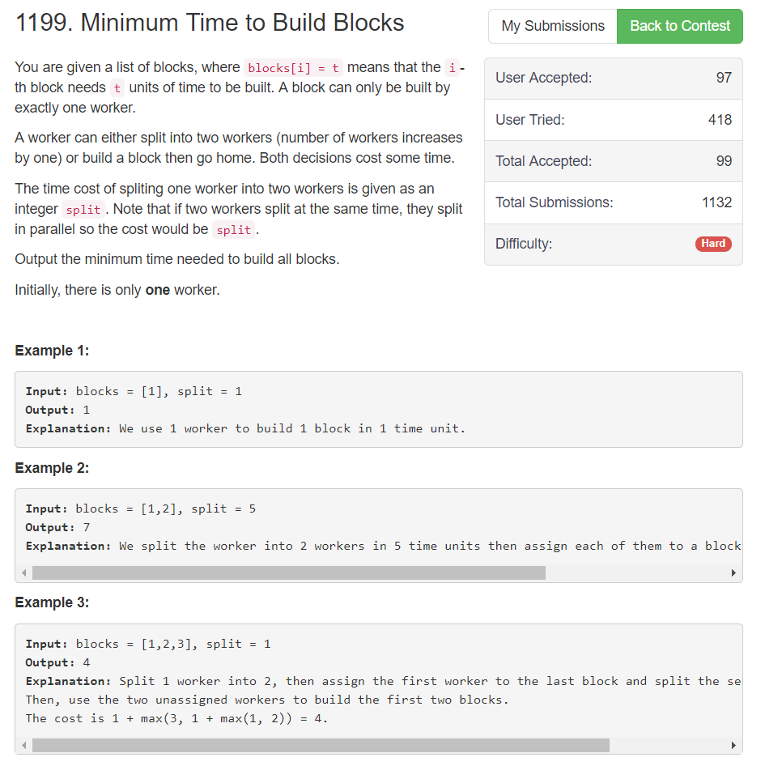

这道题的想法是将问题抽象成一颗哈夫曼树，求取的是哈夫曼树的最长路径（变形在多加一个split 的值），用优先队列或是最小堆实现
```python
import heapq
class Solution:
    def minBuildTime(self, blocks: List[int], split: int) -> int:
        if len(blocks) == 0:
            return 0
        elif len(blocks) == 1:
            return blocks[0]
        
        queue = []
        for val in blocks:
            heapq.heappush(queue, val)
        
        length = 0
        while True:
            top1 = heapq.heappop(queue)
            top2 = heapq.heappop(queue)
            length = split + max(top1, top2)
            if not queue:
                break
            else:
                heapq.heappush(queue, length)
                
        return length
```