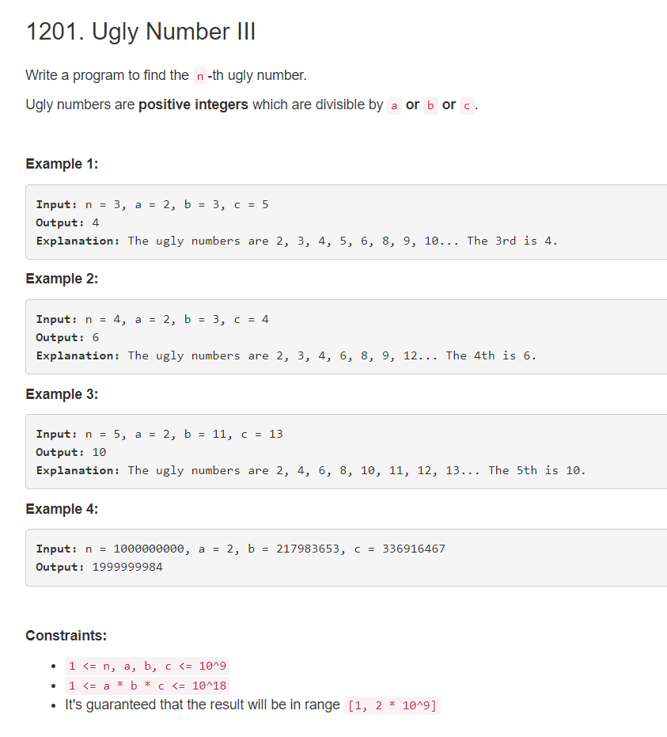

```python
class Solution:
    def nthUglyNumber(self, n: int, a: int, b: int, c: int) -> int:
    	#  code copied
    	# 这道题的思路是计算比x小的有多少个满足情况的数字
    	# 因此，可以对数字进行二分查找，也就是o(lgn)
    	# 与常规的想法 去从小数倍数什么的思路 找准确的第k个数字不同。
    	# 常规的O(n)的想法可以用最小堆，记录倍数的方式
        def gcd(x, y):
            return x if y == 0 else gcd(y, x % y)
        
        ab = a / gcd(a, b) * b
        bc = b / gcd(b, c) * c
        ca = c / gcd(c, a) * a
        abc = ab / gcd(ab, c) * c
        
        def f(x):
            # 计算x 下有多少个数
            return x // a + x // b + x // c - x // ab - x // bc - x // ca + x // abc
        
        l, r = 1, 2 * pow(10, 9) + 1
        while l <= r:
            mid = (l + r) // 2
            s = f(mid)
            if s == n:
                return mid - min([mid % a, mid % b, mid % c])
            elif s < n:
                l = mid + 1
            else:
                r = mid - 1
```
