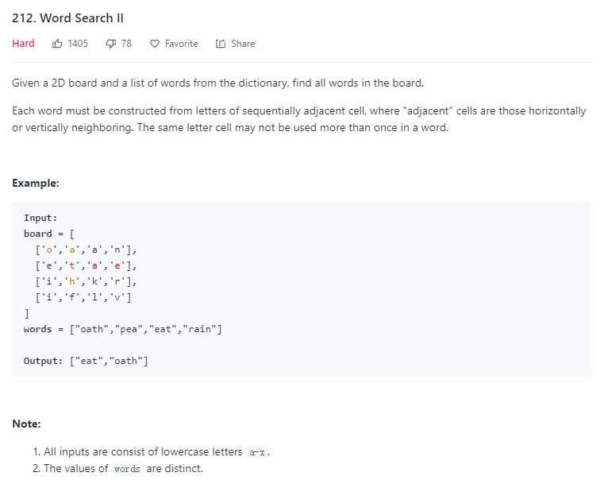

就觉得是一道dfs， 简单的写自然过不了。
TLE
```python
class Solution:
    def findWords(self, board,words) :
        a, b = len(board), len(board[0])
        used = [[1] * b for k in range(a)]

        def fun(word, used, i, j):
            # print(used)
            if len(word) == 1 and board[i][j] == word[0] and used[i][j] !=0:
                return True
            if word[0] != board[i][j] or (word[0] == board[i][j] and used[i][j] == 0):
                return False
            used[i][j] = 0
            # print('ab')
            lst = []
            for x, y in ((0, -1), (-1, 0), (0, 1), (1, 0)):
                ii, jj = i + x, j + y
                if 0 <= ii < a and 0 <= jj < b:
                    lst.append(fun(word[1:], used, ii, jj))
            used[i][j] = 1
            _res = False
            # print(lst)
            for k in range(len(lst)):
                _res |= lst[k]
            return _res

        res = []
        for i in range(len(words)):
            word = words[i]
            used = [[1] * b for k in range(a)]
            for j in range(a):
                for k in range(b):
                    if board[j][k] == word[0]:
                        if fun(word, used, j, k):
                            res.append(word)
                            break
                if res and res[-1] == word:
                    break
        return res
```


看题解说是一道字典树，还得好好理解一下
https://leetcode.com/problems/word-search-ii/solution/

```python
class Solution:
    def findWords(self, board: List[List[str]], words: List[str]) -> List[str]:
        WORD_KEY = '$'
        
        trie = {}
        for word in words:
            node = trie
            for letter in word:
                # retrieve the next node; If not found, create a empty node.
                node = node.setdefault(letter, {})
            # mark the existence of a word in trie node
            node[WORD_KEY] = word
        
        rowNum = len(board)
        colNum = len(board[0])
        
        matchedWords = []
        
        def backtracking(row, col, parent):    
            
            letter = board[row][col]
            currNode = parent[letter]
            
            # check if we find a match of word
            word_match = currNode.pop(WORD_KEY, False)
            if word_match:
                # also we removed the matched word to avoid duplicates,
                #   as well as avoiding using set() for results.
                matchedWords.append(word_match)
            
            # Before the EXPLORATION, mark the cell as visited 
            board[row][col] = '#'
            
            # Explore the neighbors in 4 directions, i.e. up, right, down, left
            for (rowOffset, colOffset) in [(-1, 0), (0, 1), (1, 0), (0, -1)]:
                newRow, newCol = row + rowOffset, col + colOffset     
                if newRow < 0 or newRow >= rowNum or newCol < 0 or newCol >= colNum:
                    continue
                if not board[newRow][newCol] in currNode:
                    continue
                backtracking(newRow, newCol, currNode)
        
            # End of EXPLORATION, we restore the cell
            board[row][col] = letter
        
            # Optimization: incrementally remove the matched leaf node in Trie.
            if not currNode:
                parent.pop(letter)

        for row in range(rowNum):
            for col in range(colNum):
                # starting from each of the cells
                if board[row][col] in trie:
                    backtracking(row, col, trie)
        
        return matchedWords    
```
自己看到的比较好理解的一个实现
```python
class TrieNode():
    def __init__(self):
        self.children = collections.defaultdict(TrieNode)
        self.isWord = False
    
class Trie():
    def __init__(self):
        self.root = TrieNode()
    
    def insert(self, word):
        node = self.root
        for w in word:
            node = node.children[w]
        node.isWord = True
    
    def search(self, word):
        node = self.root
        for w in word:
            node = node.children.get(w)
            if not node:
                return False
        return node.isWord
    
class Solution(object):
    def findWords(self, board, words):
        res = []
        trie = Trie()
        node = trie.root
        for w in words:
            trie.insert(w)
        for i in xrange(len(board)):
            for j in xrange(len(board[0])):
                self.dfs(board, node, i, j, "", res)
        return res
    
    def dfs(self, board, node, i, j, path, res):
        if node.isWord:
            res.append(path)
            node.isWord = False
        if i < 0 or i >= len(board) or j < 0 or j >= len(board[0]):
            return 
        tmp = board[i][j]
        node = node.children.get(tmp)
        if not node:
            return 
        board[i][j] = "#"
        self.dfs(board, node, i+1, j, path+tmp, res)
        self.dfs(board, node, i-1, j, path+tmp, res)
        self.dfs(board, node, i, j-1, path+tmp, res)
        self.dfs(board, node, i, j+1, path+tmp, res)
        board[i][j] = tmp
```
