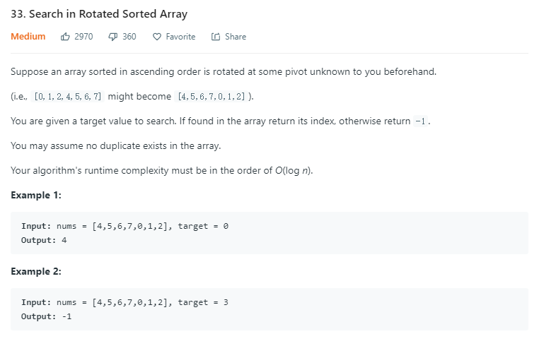

1.这道题的思路可以是二分先找最小值，然后再二分的在两个子序列中搜索目标数；
2.直接搜索目标的值，但是判定条件需要更加的精细。
```python
class Solution:
    def search(self, nums: List[int], target: int) -> int:
        L, H = 0, len(nums)
        while L < H:
            M = (L+H) // 2
            if nums[M] < nums[0] <= target: # +inf
                H = M
            elif nums[M] > nums[0] > target: # -inf
                L = M+1
            elif nums[M] < target:
                L = M+1
            elif nums[M] > target:
                H = M
            else:
                return M
        return -1
```