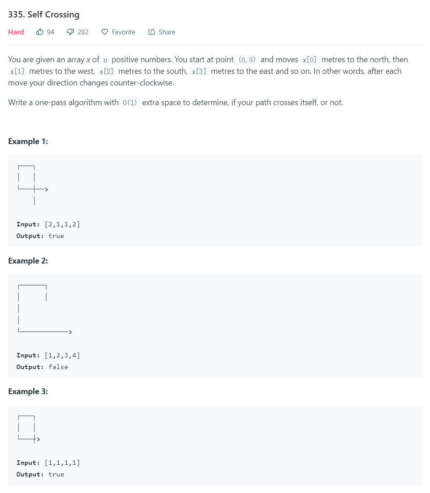
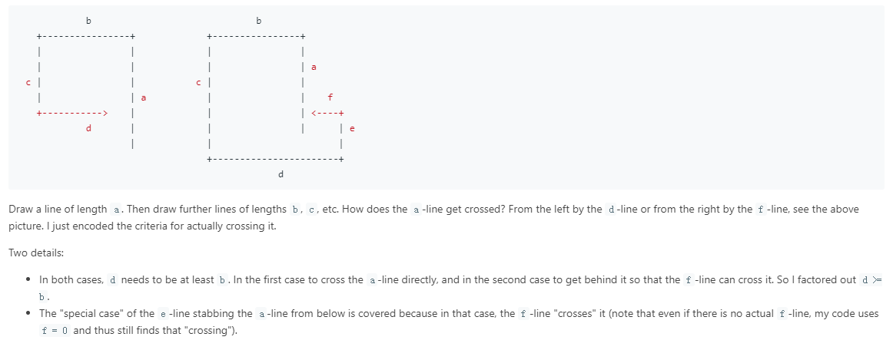

#这道题的想法是check每6条边的关系，两种情况都是比较容易想到，代码的构造没有这个简洁

```python
class Solution:
    def isSelfCrossing(self, x: List[int]) -> bool:
        b = c = d = e = 0
        for a in x:
            if d >= b > 0 and (a >= c or a >= c-e >= 0 and f >= d-b):
                return True
            b, c, d, e, f = a, b, c, d, e
        return False
```