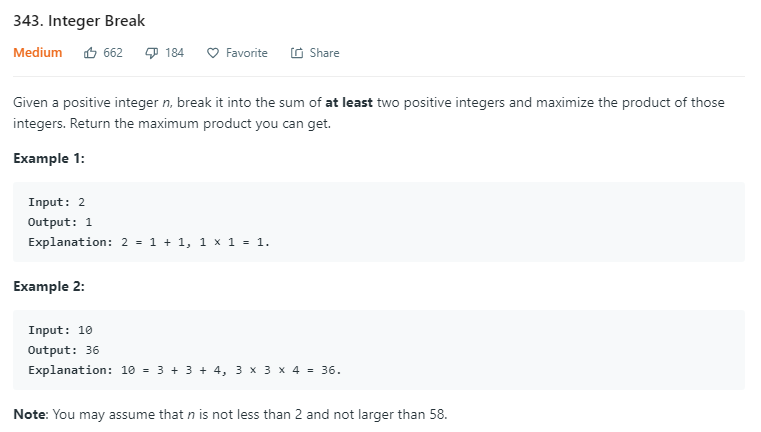

```python
import math
class Solution:
    def integerBreak(self, n: int) -> int:
        # 6=3+3=2+2+2
        # 先满足分解为3的 除了 2*2 >3*1
        if n<4:
            return n-1
        else:
            if n%3==1:
                return int(math.pow(3,n//3-1)*4)
            elif n%3 ==2:
                return int(math.pow(3,n//3)*2)
            else:
                return int(math.pow(3,n//3))	
```

