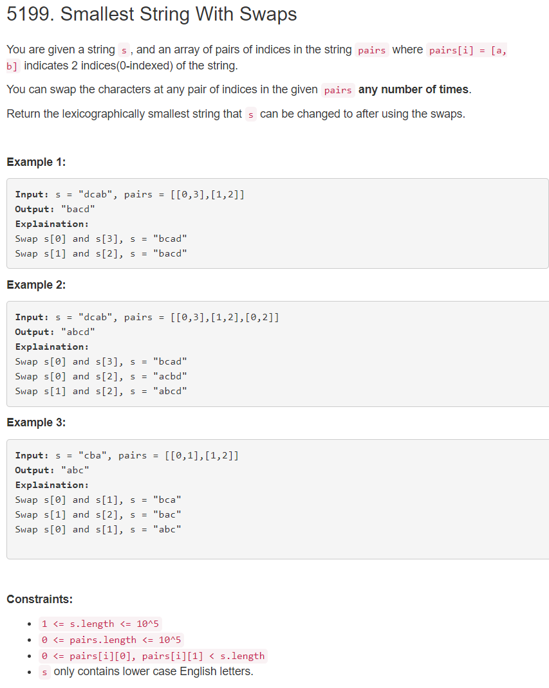

```python
class Solution:
    def smallestStringWithSwaps(self, s: str, pairs: List[List[int]]) -> str:
    	# the idea is that: as we can swap the relations in pairs for infinity times, so the optimal string in the connected subgraph always can be got. So as long as we find all the connected subgrapph, sort the related position, and then concatcnate them according to the positions.
        # special case: some positions not in pairs, so these position do not need to sort.
        # however the code is trash.
        f ={}
        l = len(pairs)
        # construct graph
        for i,j in pairs:
            if i in f.keys():
                f[i].append(j)
            else:
                f[i] = [j]
            
            if j in f.keys():
                f[j].append(i)
            else:
                f[j] = [i]
        # get connected subgraph
        d =[]
        visit =set()
        def dfs(s):
            if s in visit:
                return
            d[-1].add(s)
            visit.add(s)
            if s in f.keys():
                for k in f[s]:
                    dfs(k)
        for i,j in pairs:
            if i in visit:
                continue
            else:
                d.append(set())
                dfs(i)
        
        # add subgraph not in pairs 
        all_set = set([i for i in range(len(s))])
        
        for i in range(len(d)):
            tmp = d.pop(0)
            all_set -=tmp
            tmp =sorted(list(tmp))
            d.append(tmp)
        
        
        res = []
        for k in d:
            tmp = ''
            for i in k:
                tmp+=s[i]
            tmp = sorted(tmp)
            res.append(tmp)
            
        # add the subgraph 
        # do not sort the relative position
        if len(all_set) !=0:
            all_set = sorted(list(all_set))
        
            d.append(all_set)    
            tmp = ''
            for i in all_set:
                tmp+=s[i]
            res.append(tmp)
        # print(d)
        
        # merge the k subgraph in d
        import heapq
        h = []
        for k in range(len(d)):
            heapq.heappush(h,(d[k][0],k,0))
        kkk =''
        while h:
            kkkk,k,index = heapq.heappop(h)
            kkk+=res[k][index]
            if index <len(d[k])-1:
                heapq.heappush(h,(d[k][index+1],k,index+1))
        return kkk
            
        
            
```

introduce two solutions using union-find algorithm
```python
from collections import defaultdict

class DSU:
    def __init__(self):
        self.parents = range(100001)
        self.rank = [0 for i in range(100001)]

    def find(self, x):
        if self.parents[x]!=x:
            self.parents[x] = self.find(self.parents[x])
        return self.parents[x]

    def union(self, x, y):
        xr,yr = self.find(x),self.find(y)
        if xr == yr:
            return False
        if self.rank[xr]<self.rank[yr]:
            self.parents[xr] = yr
        elif self.rank[xr]>self.rank[yr]:
            self.parents[yr] = xr
        else:
            self.parents[xr] = yr
            self.rank[yr] += 1
        return True


class Solution(object):
    def smallestStringWithSwaps(self, s, pairs):
        """
        :type s: str
        :type pairs: List[List[int]]
        :rtype: str
        """
        
        dsu = DSU()
        for pair in pairs:
            dsu.union(pair[0],pair[1])
            
        dic = defaultdict(list)
        
        for i,j in enumerate(s):
            dic[dsu.find(i)].append(j)
            
        for key in dic.keys():
            dic[key].sort()
        # print(dic)
        res = ""
        
        for i in range(len(s)):
            res+=dic[dsu.find(i)].pop(0)
        return res
```

```python
class Solution:
    def smallestStringWithSwaps(self, s: str, pairs: List[List[int]]) -> str:
        class UF:
            def __init__(self, n): 
                self.p = list(range(n))
            def union(self, x, y): 
                self.p[self.find(x)] = self.find(y)
            def find(self, x):
                if x != self.p[x]: 
                    self.p[x] = self.find(self.p[x])
                return self.p[x]
        uf, res, m = UF(len(s)), [], defaultdict(list)
        for x,y in pairs: 
            uf.union(x,y)
        for i in range(len(s)): 
            m[uf.find(i)].append(s[i])
        for comp_id in m.keys(): 
            m[comp_id].sort(reverse=True)
        for i in range(len(s)): 
            res.append(m[uf.find(i)].pop())
        return ''.join(res) 
            
```

