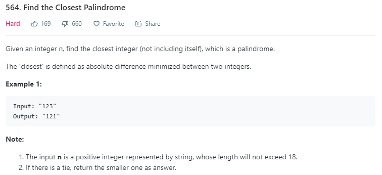

贴一下别人的题解：

Let's build a list of candidate answers for which the final answer must be one of those candidates. Afterwards, choosing from these candidates is straightforward.

If the final answer has the same number of digits as the input string S, then the answer must be the middle digits + (-1, 0, or 1) flipped into a palindrome. For example, 23456 had middle part 234, and 233, 234, 235 flipped into a palindrome yields 23332, 23432, 23532. Given that we know the number of digits, the prefix 235 (for example) uniquely determines the corresponding palindrome 23532, so all palindromes with larger prefix like 23732 are strictly farther away from S than 23532 >= S.

If the final answer has a different number of digits, it must be of the form 999....999 or 1000...0001, as any palindrome smaller than 99....99 or bigger than 100....001 will be farther away from S.

```python
class Solution(object):
	def nearestPalindromic(self, S):
    	K = len(S)
    	candidates = [str(10**k + d) for k in (K-1, K) for d in (-1, 1)]
    	prefix = S[:(K+1)/2]
    	P = int(prefix)
    	for start in map(str, (P-1, P, P+1)):
        	candidates.append(start + (start[:-1] if K%2 else start)[::-1])
    
    	def delta(x):
        	return abs(int(S) - int(x))
    
    	ans = None
    	for cand in candidates:
        	if cand != S and not cand.startswith('00'):
            	if (ans is None or delta(cand) < delta(ans) or
                    	delta(cand) == delta(ans) and int(cand) < int(ans)):
                	ans = cand
    	return ans

    def nearestPalindromic(self, n):
        """
        :type n: str
        :rtype: str
        """
        # based on @awice and @o_sharp
        l = len(n)
        # with different digits width, it must be either 10...01 or 9...9
        candidates = set((str(10 ** l + 1), str(10 ** (l - 1) - 1)))
        # the closest must be in middle digit +1, 0, -1, then flip left to right
        prefix = int(n[:(l + 1)/2])
        for i in map(str, (prefix - 1, prefix, prefix + 1)):
            candidates.add(i + [i, i[:-1]][l & 1][::-1])
        candidates.discard(n)
        return min(candidates, key=lambda x: (abs(int(x) - int(n)), int(x)))
```

对上面题解的一些理解：基本的思路是说先找回文，然后在这些回文中找最近的结果。那么分为和目标位数一致的回文和比目标位数多和比目标位数少的回文，后面两部分很好理解，结果分别是999...99 和100...001，主要是和目标位数一致的回文。