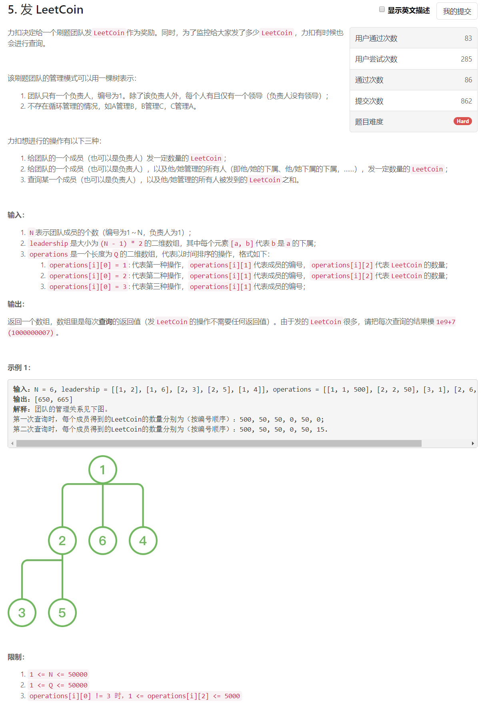

这道题像是实现题，但是实现起来有一些线段树的感觉
```python
class Solution:
    def bonus(self, n: int, leadership: List[List[int]], operations: List[List[int]]) -> List[int]:
        
        res = []
        coin = [0] * (n + 1)
        lead = {i:set() for i in range(1, n + 1)}
        leader = [0] * (n + 1)
        for l in leadership:
            lead[l[0]].add(l[1])
            leader[l[1]] = l[0]
        
        def F1(i, c):
            if i == 0: 
                return
            coin[i] += c
            F1(leader[i], c)
        
        def F2(i, c):
            t = sum((F2(j, c) for j in lead[i]), 0) + c
            coin[i] += t
            return t
        
        for ope in operations:
            if ope[0] == 1:
                F1(ope[1], ope[2])
                
            elif ope[0] == 2:
                t = F2(ope[1], ope[2])
                F1(leader[ope[1]], t)

            else:
                res.append(coin[ope[1]])
        return [r % 1000000007 for r in res]
```